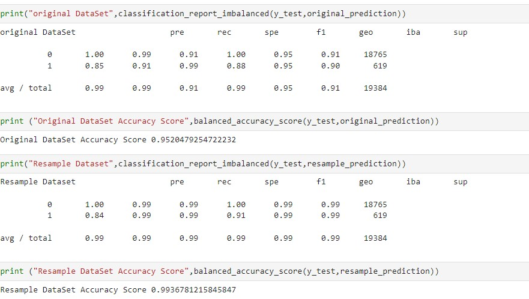

# Challenge_12_Creditworthiness_of_borrowers
The main objective of this challenge was to build a neural network model that was able to idenfity the creditworthiness of borrowers with a high accuracy.

---
## Technologies
The programming language used for this analysis was **Python (v 3.9.7)**.

The applicable libraries needed to run this analysis are:

` 1. Path from pathlib 2. pandas 3. numpy 4. sklearn.metrics 5. imblean.metrics 6. sklearn.model_selection 7. sklearn.linear_model   `

---
## Installation Guide
Majority of the above libraries should be part of the base applications that were installed with the Python version above; if not, you will have to install them through the pip package manager of Python.

[PIP Install Support Web Site](https://packaging.python.org/en/latest/tutorials/installing-packages/#ensure-you-can-run-python-from-the-command-line)

---
## Contribution

James Handral

James.Handral@gmail.com

---
## License

N/A

---

## Challenge Summary
1. Split the Data into training and testing sets
2. Create a Logistic Regression Model with the Original Data
3. Predict a Logistic Regression Model with Resampled Training Data
4. Write a Credit Risk Analysis Report

---
## Credit Risk Analysis 

The Objective of this Credit Risk Analysis is to determine if a model created to identify the creditworhiness of borrowers will be more effective utilzing an imbalance dataset or a resampling dataset (of smaller class) for its predictions.

First, the accuracy score is slightly higher for the resampling data (0.99 vs 0.95), meaning that the model using the resampling data was much better at detecting true positives and true negatives.

The precision for the minority class is slightly higher with the orignal data (0.85) versus the resampling data (0.84) meaning that the original data was slightly better at detecting the high risk loans.

In terms of the recall, however, the minority class metric using resampled data was much better (0.99 vs 0.91). Meaning that the resampled data correctly classified a higher percentage of the truly high risk loans.

My recommendation, the model using resampled data was much better at identify the creditworthiness of borrowers than the model generated using the original, imbalanced dataset.

---

 **link to Jupyter notebook with the Neural Network model program**

 [Credit_Risk_Neural_Network_Algorithm](./Starter_Code%20(12)/Starter_Code/credit_risk_resampling.ipynb)

